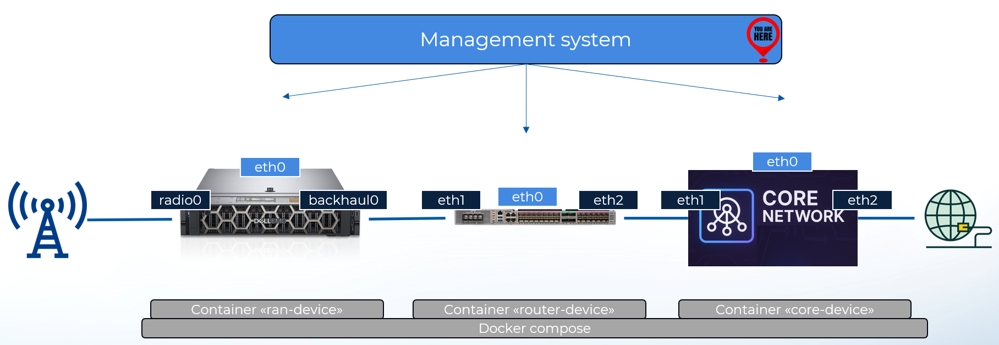

# NETCONF & Network Automation

## Architecture 

## Setup

Install the following in your Linux distribution:
* docker
* docker compose
* python3
* pip3
    * ncclient
    * netconf-console2
    * paramiko
* ansible

Depending on the distribution, only one of the two commands below will work:
    docker-compose up

    docker compose up

## Exercise 1

### Check initial configuration

netconf-console2 --host localhost --port 830 --get-config 
netconf-console2 --host localhost --port 830 --db=startup --get-config 
netconf-console2 --host localhost --port 830 --db=candidate --get-config 

### Modify network

Modify operations/change-eth0.xml

netconf-console2 --host localhost --port 830 --edit-config operations/change-eth0.xml
netconf-console2 --host localhost --port 831 --edit-config operations/change-eth0.xml
netconf-console2 --host localhost --port 832 --edit-config operations/change-eth0.xml

python network-check.py

### Work with candidate

netconf-console2 --host localhost --port 830 --db=candidate --edit-config cleanup/change-eth0.xml

netconf-console2 --host localhost --port 830 --db=startup --get-config | grep 192
netconf-console2 --host localhost --port 830 --db=running --get-config | grep 192
netconf-console2 --host localhost --port 830 --db=candidate --get-config | grep 192

netconf-console2 --host localhost --port 830 --commit

netconf-console2 --host localhost --port 830 --db=startup --get-config | grep 192
netconf-console2 --host localhost --port 830 --db=running --get-config | grep 192
netconf-console2 --host localhost --port 830 --db=candidate --get-config | grep 192

## Automate with Python 

